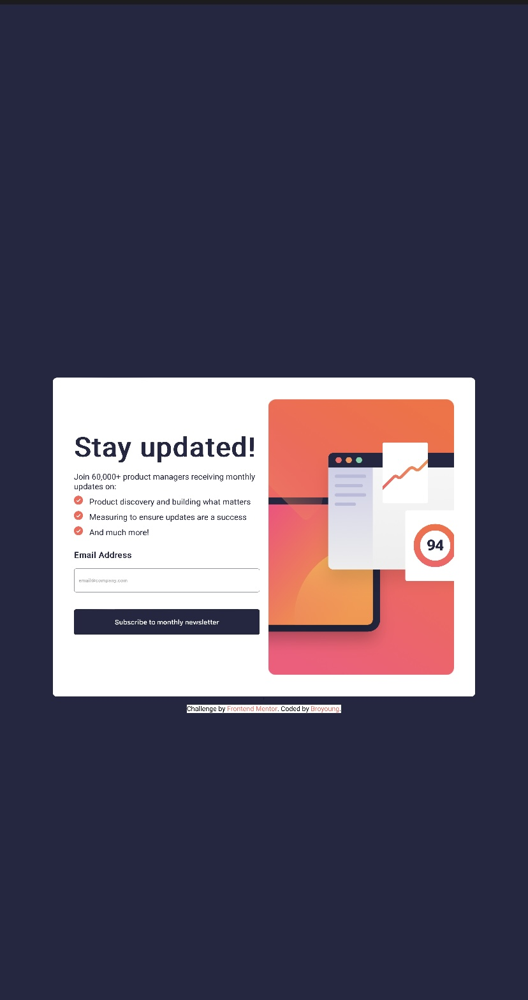

# Frontend Mentor - Newsletter sign-up form with success message solution

This is a solution to the [Newsletter sign-up form with success message challenge on Frontend Mentor](https://www.frontendmentor.io/challenges/newsletter-signup-form-with-success-message-3FC1AZbNrv). Frontend Mentor challenges help you improve your coding skills by building realistic projects. 

## Table of contents

- [Overview](#overview)
  - [The challenge](#the-challenge)
  - [Screenshot](#screenshot)
  - [Links](#links)
- [My process](#my-process)
  - [Built with](#built-with)
  - [What I learned](#what-i-learned)
  - [Author](#author)
- [Acknowledgments](#acknowledgments)


## Overview

### The challenge

Users should be able to:

- Add their email and submit the form
- See a success message with their email after successfully submitting the form
- See form validation messages if:
  - The field is left empty
  - The email address is not formatted correctly
- View the optimal layout for the interface depending on their device's screen size
- See hover and focus states for all interactive elements on the page

### Screenshot




### Links

- Solution URL: [Add solution URL here](https://your-solution-url.com)
- Live Site URL: [Live site URL](https://broyoung4.github.io/Newsletter-with-success-message/?)

## My process

### Built with

- Semantic HTML5 markup
- CSS custom properties
- Flexbox
- CSS Grid
- Vanilla JS


### What I learned

I learnt how to filter through an array of input values with regular expression in javascript 


```js
const regex = /^[^\s@]+@[^\s@]+\.[^\s@]+$/; // Regular expression for email validation
```


## Author

- Website - [Adebayo Oladeji](https://www.github.com/broyoung4)
- Frontend Mentor - [@Broyoung4](https://www.frontendmentor.io/profile/Broyoung4)
- Twitter - [@broyoung4](https://x.com/broyoung4?s=21&t=3KdcJrVgTGAh_8bjJ3YWRA)


## Acknowledgments

i acknowledge my efforts, accomplishing new strides everyday


